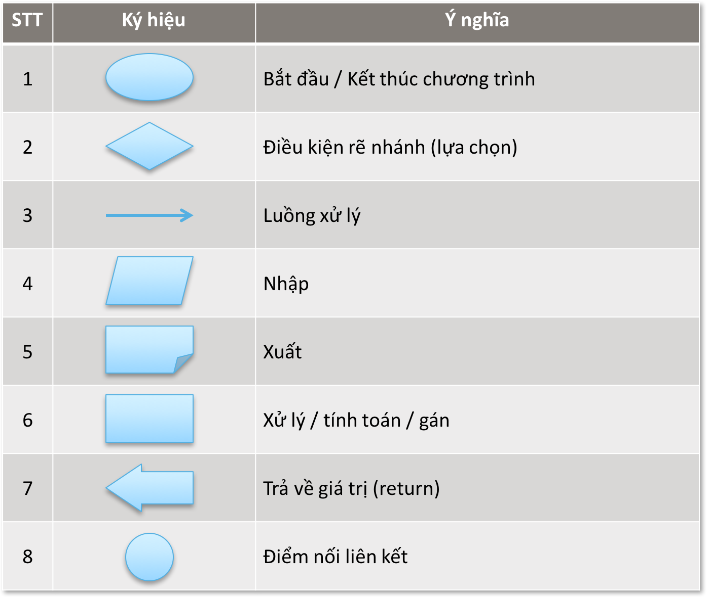
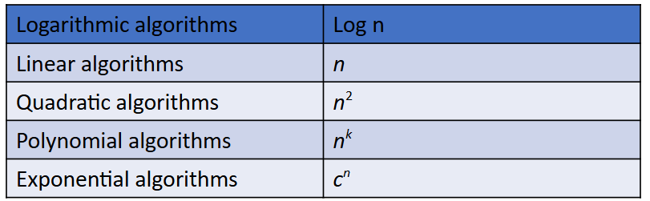

# Fundamental and characteristic
- Quy trình giải 1 bài toán trên máy tính (7 bước):
	- XD mô hình bài toán
	- Thiết kế CSDL 
	- Thiết kế giải thuật
	- Chọn ngôn ngữ code
	- Viết code
	- Thử nghiệm code
	- Phấn tích kết quả
- Bản chất: Programs = Data structure + Algorithm
- **Giải thuật** (Algorithm) là một dãy các qui tắc chặt chẽ xác định một trình tự các thao tác trên một đối tượng cụ thể để giải quyết một vấn đề hoặc để hoàn thành một mục đích cuối cùng nào đó
- 3 cấu trúc điều khiển chính
	- **Tuần tự (Sequential)**: linear code
	- **Chọn lọc (Selection)**: if-else
	- **Chu trình(Repetition)** Looping
- Các PP thiết kế algorithm
	- Sử dụng phương hướng tiếp cận từ đỉnh xuống (**Top Down Design**) để viết các chương trình phức tạp: dựa trên cơ sở của module hóa khi tiếp cận vấn đề từ đỉnh rồi nghĩ các thành phần code cho các nhánh con, ngược lại của nó là **Bottom Up Design**
	- Sử dụng các cấu trúc diều khiển cơ bản để thiết kế cho từng đơn thể của chương trình (**Program Module**): gần như chia để trị/giải
	- Sử dụng các biến cục bộ (Local variables) trong các chương trình con
	- Sử dụng các tham số để truyền tham số . Tránh dùng các biến toàn cục (Global variables) để truyền tham số giữa các chương trình con , bởi vì điều đó làm phá vỡ tính độc lập của các chương trình con
	- Lựa chọn thành phần (Component Selection): chọn các thành phần tốt và tối ưu trước, thành phần không tốt chọn sau
- Các PP biểu diễn algorithm (3):
	- Bằng lời: Sử dụng các ngôn ngữ tự nhiên để diễn tả algo (VD như Bước 1, 2, 3, ...) (người đọc dễ dàng hiểu nhưng còn rất thô nên khi chuyển sang các ngôn ngữ code phải làm mịn dần)
	- Sơ đồ khối: cho một cái nhìn tổng thể về PP giải quyết bài toán đặt ra 
	- Code (C++, python, JS, ...): Biểu diễn giải thuật 1 cách ngắn gọn
- Dữ liệu cơ sở là một tập hợp các phần tử dữ liệu ban đầu trong một bài toán (var name, money, bool, ...)
- **Cấu trúc dữ liệu** là kết hợp các dữ liệu cơ sở theo một phương thức nào đó nhằm liên kết chúng thành một cấu trúc thống nhất tiện lợi cho quá trình xử lý 
- Phương thức biểu diễn một cấu trúc dữ liệu trong bộ nhớ được gọi là **cấu trúc lưu trữ (Storage Structure)**, không đồng nhất với DS do cùng 1 DS có nhiều cách biểu diễn khác nhau trong bộ nhớ 
- Hiệu suất của algorithm:
	- Thời gian: 
		- Qui tắc cộng: Thời gian thực hiện hai giải thuật liên tiếp là $$T = T1(n) + T2 (n);T=O(max⁡(f(n),g(n)))$$ Đối với T thì for/if/... cũng tính là 1 lệnh tuyến tính
		- Qui tắc nhân: $$T=O(f(n)⋅g(n)))$$
	- Không gian: là các DS và input (yếu tố trực tiếp ảnh hưởng đến thời gian - hiển nhiên vì input nhỏ chạy nhanh dù algo có ngon đến mấy đi nx)
# Linear Data Structure
- **Mảng (Array):** một tập hợp có thứ tự bao gồm một số lượng cố định các phần tử, được truy cập với cùng một tên
	- Ưu tiên dòng: classic
	- Ưu tiên cột: xử lý cột 1 r mới fill côt 2 ...
	- Địa chỉ cơ sở là địa chỉ của ô nhỏ đầu tiên để lưu trữ phần tử trong mảng (chính lò vị trí của phần tử đầu tiên trong mảng). địa chỉ CƠ SỞ của mảng A ký hiệu lò Base(A)
- **Danh sách (list):** biết 1 mới biết 2 biết 3, ... theo thứ tự, phù hợp cho cái gì có STT để tiện sửa về sau này, mảng thì random shit nên ko dùng đc các kĩ thuật thao túng thứ tự
	- Searching: thông tin search coi là các KEY, return position
	- Appending: thêm thông tin vào làm thay đổi vị trí (mid), hoặc không nếu append vào đầu hoặc cuối
	- Deleting: như append
	- Updating
	- Divide and merging
	- Suffle: trộn 2 list vào theo quy tắc nào đấy
	- Sorting
- **Stack** - Danh sách hạn chế: FILO (Ctrl Z/Y on a computer): kiểu danh sách tuyến tính đặc biệt mà việc bổ sung hay loại một phần tử chỉ thực hiện ở một đầu gọi là đỉnh (Top).
```cpp fold="Stack"
class Stack {
    int* arr, top, size;
public:
    Stack(int s) : size(s), top(-1) { arr = new int[size]; }
    void push(int val) { if (top < size - 1) arr[++top] = val; }
    void pop() { if (top >= 0) --top; }
};
```
- **Queue**: FIFO (server working flow, avoid overflowing working job): linear (tuần tự) list mà phép bộ sung một phân tử được thực hiện ở một đâu gọi là lối sau (Rear) còn phép loại bỏ một phân từ thực hiện ở một đâu khác gọi là lối trước (Front).
	- **Circular Queue**: do nếu queue array thì nó cứ sẽ tiếp tục đớp bộ nhớ, cứ thêm phần tử thì front nó tiến tiếp trong bộ nhớ -> ko bền -> nối vòng nó lại để tiết kiệm bộ nhớ -> ưu tiên dùng cái này trong project
	- Queue coi là rỗng nếu front = rear
```cpp fold="Queue-Circular"
class CircularQueue {
    int *queue, front, rear, size;
public:
    CircularQueue(int n) {
        size = n;
        queue = new int[size];
        front = rear = -1;
    }
    void enqueue(int value) {
        if ((rear + 1) % size == front) {
            cout << "Queue is Full!\n";
            return;
        }
        if (front == -1) front = 0; // Queue is empty
        rear = (rear + 1) % size;
        queue[rear] = value;
    }
    void dequeue() {
        if (front == -1) {
            cout << "Queue is Empty!\n";
            return;
        }
        cout << "Dequeued: " << queue[front] << endl;
        if (front == rear) front = rear = -1; // Queue becomes empty
        else front = (front + 1) % size;
    }
    void display() {
        if (front == -1) {
            cout << "Queue is Empty!\n";
            return;
        }
        cout << "Queue: ";
        for (int i = front; i != rear; i = (i + 1) % size)
            cout << queue[i] << " ";
        cout << queue[rear] << endl;
    }
};
```
- Linked List: gồm 1 data block và 1  address block
	- Delete, add, update: cho duyệt qua 1 lần, đúng node cần tìm thì thao túng nó
	- Double Linked list: có thêm 1 address block nữa trỏ về ele trước đó 
	- Linked in Stack and Queue: thay vid dùng array thì sẽ sử dụng các Node để lưu trữ thông tin 
```cpp fold="Linked list"
// singular linked list
struct Node {
    int data;
    Node* next;
    Node(int val) : data(val), next(nullptr) {}
};
class SinglyLinkedList {
    Node* head;
public:
    SinglyLinkedList() : head(nullptr) {}
    void insert(int val) {
        Node* newNode = new Node(val);
        newNode->next = head;
        head = newNode;
    }
};
// double linked list
struct Node {
    int data;
    Node* next;
    Node* prev;
    Node(int val) : data(val), next(nullptr), prev(nullptr) {}
};
class DoublyLinkedList {
    Node* head;
public:
    DoublyLinkedList() : head(nullptr) {}
    void insert(int val) {
        Node* newNode = new Node(val);
        if (head) head->prev = newNode;
        newNode->next = head;
        head = newNode;
    }
};
```
# Non-linear DS
## Tree
- Là một tập hợp hữu hạn các nút có mối quan hệ phân cấp xuất phát từ một nút (gốc-root-mức 1)
- Binary Tree: 2 nút (L and R)
- Phương pháp lưu trữ:
	- Mảng: bố thứ `i` thì L là `2i` và R là `2i+1` -> không tối ưu vì con trống thì vẫn phải lưu
	- Double Linked list
```cpp fold="Create Tree"
// array based tree
class BinaryTreeArray {
    int* tree;
    int size;
public:
    BinaryTreeArray(int n) : size(n) {
        tree = new int[size];
        fill(tree, tree + size, -1);
    }
    void setRoot(int val) { tree[0] = val; }
    void setLeft(int parentIdx, int val) {
        if (parentIdx * 2 + 1 < size) 
            tree[parentIdx * 2 + 1] = val;
    }
    void setRight(int parentIdx, int val) {
        if (parentIdx * 2 + 2 < size) 
            tree[parentIdx * 2 + 2] = val;
    }
};
// Double Linked list based tree
struct Node {
    int data;
    Node* left;
    Node* right;
    Node(int val) : data(val), left(nullptr), right(nullptr) {}
};

class BinaryTreeLinkedList {
    Node* root;
public:
    BinaryTreeLinkedList() : root(nullptr) {}
    void setRoot(int val) { root = new Node(val); }
    Node* getRoot() { return root; }
    void setLeft(Node* parent, int val) {
        if (parent) 
            parent->left = new Node(val);
    }
    void setRight(Node* parent, int val) {
        if (parent) 
            parent->right = new Node(val);
    }
    void inorder(Node* node) {
        if (node) {
            inorder(node->left);
            cout << node->data << " ";
            inorder(node->right);
        }
    }
};
```
- Quét cây: đệ quy là chính, duyệt trung/hậu/tiền thứ tự
	- Tiền: gốc - trái - phải
	- Trung: trái - gốc - phải
	- Hậu: trái - phải - gốc
```cpp fold="Duyệt cây"
void inorder(Node* node) {
    if (node) {
        inorder(node->left);
        cout << node->data << " ";
        inorder(node->right);
    }
}
void preorder(Node* node) {
    if (node) {
        cout << node->data << " ";
        preorder(node->left);
        preorder(node->right);
    }
}
void postorder(Node* node) {
    if (node) {
        postorder(node->left);
        postorder(node->right);
        cout << node->data << " ";
    }
}
```
- Binary Search tree - BST: nút trái nhỏ hơn, phải lớn hơn
- AVL balanced binary tree: là BT mà đối với mọi nút của nó, chiều cao của 2 cây con tương ứng chỉ chênh nhau một đơn vị
- Optimal BST:
## Graph
- Directed graph: cạnh có hướng nối các đỉnh với nhau
	- Sử dụng ma trận kề để thiết lập graph (ma trận kề, ...) hoặc linked row list
	- Các giải thuật quét cho graph có hướng:
		- BFS: lan ra các nút khác, duyệt theo mức
		- DFS: từ trên xuống, trái -> phải
- Undirected Graph: đỉnh nối cạnh (hữu hạn)
	- Dùng ma trận kề, danh sách cạnh (Edge Node) hoặc danh sách kế
	- Các giải thuật:
		- Minimum Spanning tree:
		- Tìm đường ngắn nhất (Dijistra)
# Algorithm in Depth
- **The Divide and Conquer**: 
	- Phân tích bài toán đã cho thành các bài toán cơ sở
	- Tổng hợp kết quả từ bài toán cơ sở để có lời giải của bài toán ban đầu. 
- The Dynamic Programming (DP): Đệ quy nhưng có arr lưu lại các giá trị của 1 vùng kết quả để sử dụng lại
- The Greedy 
- The Backtracking: 3 kĩ thuật 
	- Vét cạn: đi vào đường cụt rồi mới quay lui
	- Nhánh-cận:
	- Cắt tỉa Alpha-Beta:
- Sorting:
	- Nhóm sorting đổi chỗ (n<sup>2</sup>): 
		- Insertion
		- Selection
		- Bubble sort 
	- Nhóm sorting xen vào: 
		- Insertion sort
		- Shell sort
		- Binary insertion sort (n log n to n<sup>2</sup>)
	- Nhóm soring lựa chọn:
		- Shell sort
		- Quick sort (n log n): Sử dụng pivot để chia nhỏ mảng r sort
		- Heap sort (n log n)
	- Merge sort (MVP) (n log n)
	- PP đếm (Counting sort) (n+k)
	- Etc:
		- Radix sort (nk)
		- Shakersort (n<sup>2</sup>)
- Searching: Key - giá trị cần tìm kiếm
	- Sequential: như bình thường
	- Binary Searching
	- Key-based: tạo sẵn 1 khóa mà tại đó lưu luôn địa chỉ của biến cần tìm, sau chỉ việc gọi lại địa chỉ là xong
	- Hash table: như key-based nhưng có quy tắc (hẳn 1 bảng) để dùng như từ điển
# Draft Algorithm
## BCNN, ƯCLN
```cpp
int UCLN(int a, int b) {
    while (a != b) {
        if (a > b) a -= b; 
        else b -= a;
    }
    return a;
}
  
int BCNN(int a, int b) {
    return (a * b) / UCLN(a, b);
}
```
## Sorting
### Bubble sorting 
- Fundamental sorting, by far the easiest (O(N<sup>2</sup>))
```cpp
void bubbleSort(int arr[], int n) {
    for (int i = 0; i < n-1; i++) {
        for (int j = 0; j < n-i-1; j++) {
            if (arr[j] > arr[j+1]) {
                //simple swaping algorithm sort
                int temp = arr[j];
                arr[j] = arr[j+1];
                arr[j+1] = temp;
            }
        }
    }
}
```
### Selection sort
```cpp
void selectionSort(int arr[], int n){
	for(int i=0;i<n-1;i++){
		min_index=i;
		for(int j=i+1;j<n;j++){
			if(arr[j] < arr[min_index]) min_index = j;
		}
	}
	swap(arr[i],arr[min_index]);
}
```
### Insertion Sort
```cpp
void insertionSort(int arr[], int n){
	for(int i=1;i<n;i++){
		int key = arr[i];
		int j = i-1;
		while(j>=0 && arr[j]>key){
			arr[j+1] = arr[j];
			j--;
		}
		arr[j+1]=key;
	}
}
```
### Merge Sort
- Divide and Conquer
- Split the array into 2 equal halves
- Recursively sort each half
- Merge the two sorted halves to get a sorted array
```cpp
void merge(int arr[],int l,int m,int r){
	int n1 = m-l+1;
	int n2 = r - m;
	int L[n1], R[n2];
	for(int i=0;i<n1;i++) L[i] = arr[l+i];
	for(int j=0;j<n2;j++) R[j] = arr[m+1+j];
	int i=0,j=0,k=l;
	while(i<n1 && j<n2){
		if(L[i]<=R[j]){
			arr[k] = L[i];
			i++;
		}
		else{
			arr[k] = R[j];
			j++;
		}
		k++;
	}
	while(i<n1){
		arr[k] = L[i];
		i++;
		k++;
	}
	while(j<n2){
		arr[k] = R[j];
		j++;
		k++;
	}
}
void mergeSort(int arr[],int l,int r){
	if(l<r){
		int m = l+(r-l)/2;
		mergeSort(arr,l,m);
		mergeSort(arr,m+1,r);
		merge(arr,l,m,r);
	}
}
```
### Quick Sort
- Divide and Conquer
- Pick a pivot element, place the pivot element at its correct position
```cpp
void quickSort(vector<int>& arr, int low, int high) {
    if (low < high) {
        int pivot = arr[high], i = low - 1;
        for (int j = low; j < high; j++) {
            if (arr[j] <= pivot) swap(arr[++i], arr[j]);
        }
        swap(arr[i + 1], arr[high]);
        int pi = i + 1;
        quickSort(arr, low, pi - 1);
        quickSort(arr, pi + 1, high);
    }
}
```
## Searching
### Binary Searching 
```cpp
int binarySearch(vector<int> &arr, int tar, int left, int right){
    if(right >= 1){
        int mid = left+ (right - left)/2; 
        //same to (left+right)/2 but would stop interger overflow
        
        if (tar==arr[mid]) return 1;

        if(arr[mid]>tar) return binarySearch(arr,tar,mid+1,right);
        else return binarySearch(arr,tar,left,mid-1);
    }
    return 0;
}
```

## ETC
### Kanade (Longest continuous sum)
- An algorithm to find the longest continuous sum in an array
- #longestContinuousSum
```cpp
//usage: start to end (array index) is the targeting arr and cur_max is the sum
void kanade(vector<int> &arr){
    int cur_sum = arr[0];
    int cur_max = arr[0];
    int cur_start = 0;
    int start = 0;
    int end = 0;

    for(int i=0;i<arr.size();i++){
        if(cur_sum<0){
            cur_start = i;
            cur_sum = arr[i];
        } else cur_sum += arr[i];

        if(cur_sum>cur_max){
            start = cur_start;
            end = i;
            cur_max = cur_sum;
        }
    }
    cout<<start<<' '<<end<<' '<<cur_max;
}
```

### Sàng Eratosthenes
- Tạo 1 array có số element bằng n xét r cái nào là 1 thì là số nguyên tố, set hết là 1 rồi chạy sàng mới chuyển hết về 0
- #sangNguyenTo
```cpp
void Eratosthenes(int n){
    vector<bool> arr(n+1,true);
    //set all arr natural number
    for(int i=2;i<=n;i++){
        arr[i]=1;
    }
  
    // 0 and 1 aren't natural number
    arr[0]=arr[1]=0;

    //executing...
    for(int i=2;i<sqrt(n);i++)
    if (arr[i])
        for(int j=i*i;j<=n;j+=i){
            arr[j]=0;
        }
}
```
# Some Technique
- In cpp, `new <datatype>[n]` to replace malloc() and calloc() in C, should be `delete` at the end

- Đệ quy: có **base case** và đệ quy


#competitiveProgramming
